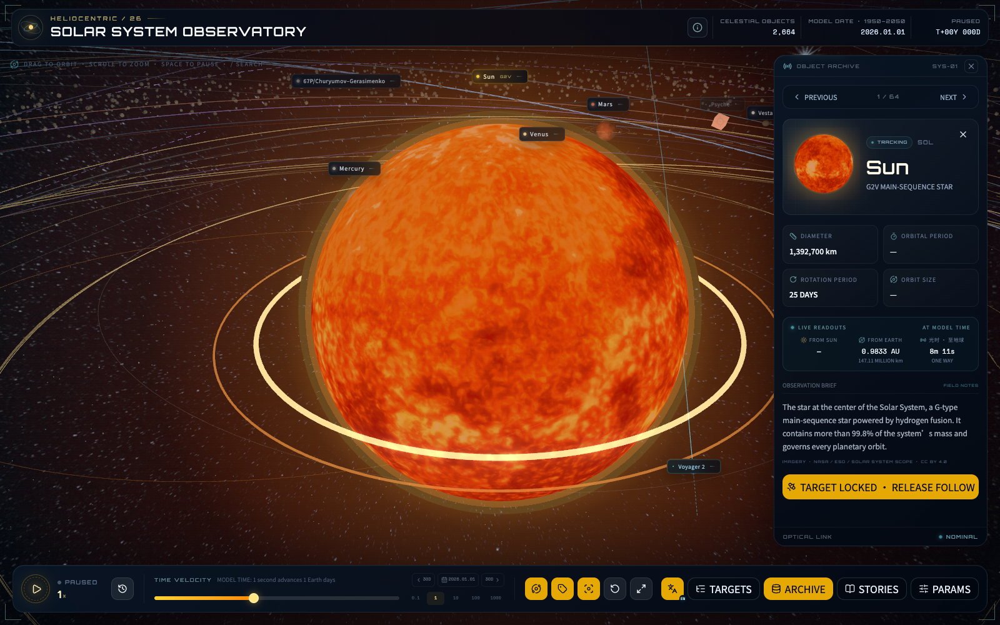
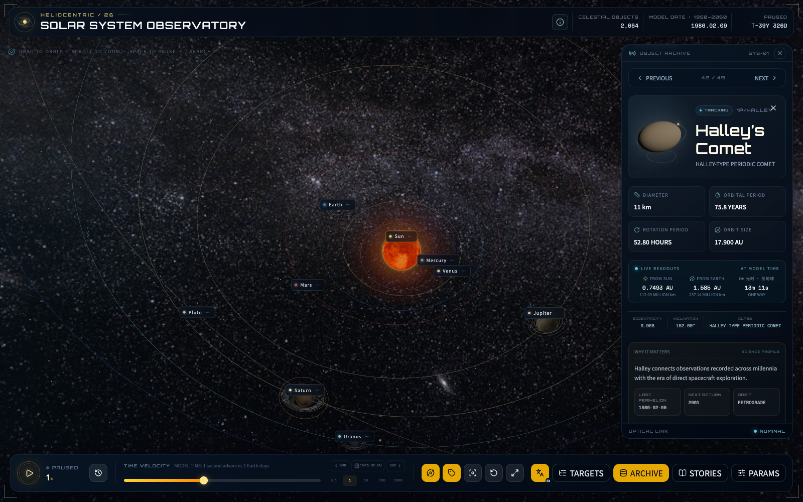
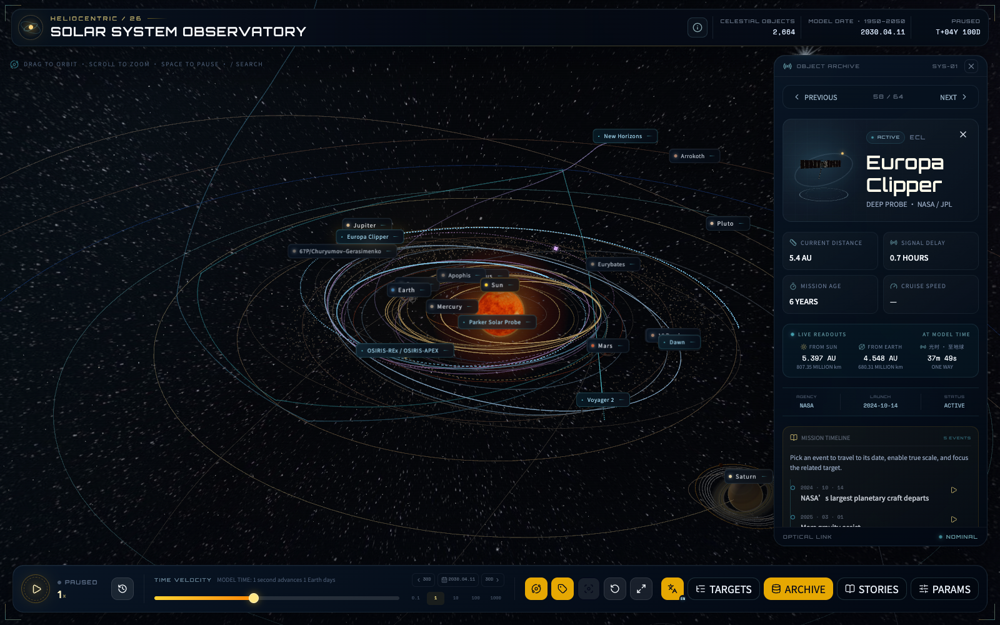
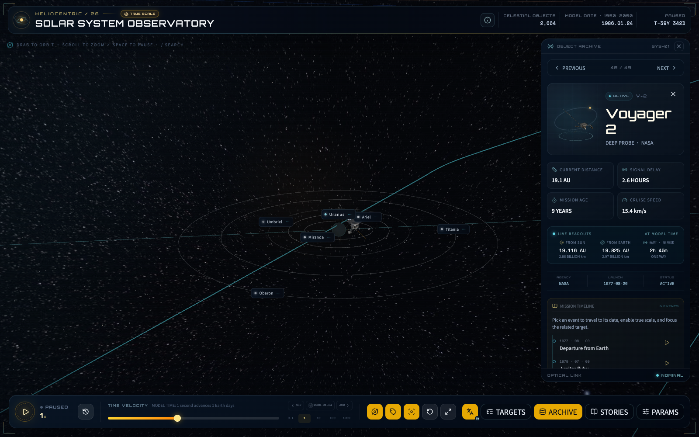
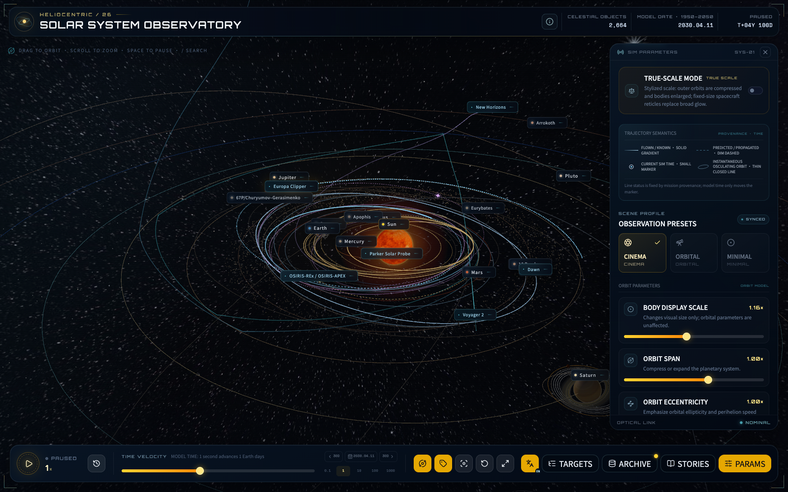

[中文](README.md) | [English](README.en.md)

# 太阳系模拟

具有未来观测台视觉的交互式三维太阳系：八大行星与冥王星、26 颗天然卫星、9 个重点小天体/彗星、18 个著名人类航天器、主小行星带与柯伊伯带、真实星历驱动的位置与时间机器（1950–2050），支持严格真实比例和纯中文 / 双语 / 纯英文界面。位置与时间来自打包的 JPL 公开数据，用于模型展示，不代表实时测量。

## 界面预览



<p align="center">
  
  
</p>

<p align="center">
  
  
</p>

<p align="center"><sub>纹理太阳 · 平滑哈雷轨道 · Europa Clipper 语义航迹 · 真实比例航天器 · 双语轨迹图例</sub></p>

## 功能

- **真实星历**：行星角位置全时段采用 JPL「Approximate Positions of the Major Planets」开普勒根数 + 世纪变率（1800–2050 有效，误差远小于屏幕像素）；默认艺术化模式仅压缩径向距离，行星方位与真实天空一致
- **严格真实比例模式**：一键切换，半径与轨道共用同一 km→场景映射，无任何物理体积放大（太阳半径约为地球轨道的 1/215）；航天器实体也按公开最大展开跨度换算。选中官方模型使用 28–44 px 的半透明中性 matcap 识别层，未选中目标使用固定 20 px 准心；两者均不依赖局部点光、自发光或大面积 Bloom 光晕
- **时间机器（1950–2050）**：时间可倒流，自定义日历支持日/月/年份分页选择，并提供覆盖 36,890 个 UTC 日期的快速年代滑杆与「今天」按钮；10 组任务故事可从任务页或航天器档案触发，回放会自动暂停、切换真实比例并跟随事件对应的航天器，遭遇天体保留为现场参照
- **十二个深空任务真实轨迹**：旅行者 1/2 号、先驱者 10 号、新视野号，以及卡西尼、伽利略、黎明、罗塞塔、OSIRIS-REx/APEX、Lucy、Psyche、Europa Clipper 使用打包 JPL Horizons 状态矢量；巡航段按 30 天、事件窗按 1 天、关键近飞窗按 6 小时混合采样，再以位置 + 速度 Hermite 曲线平滑重建
- **哈希星历按需加载**：首包只含轻量注册索引；每个任务使用内容哈希 JSON，选中目标、故事与深链优先加载，其余已发射任务在浏览器空闲时串行渐进加载。渲染热路径读取同步缓存，不会把单体轨迹包塞进主 JavaScript
- **轨迹语义与降噪**：未选中航天器只显示截至模型时刻的最近 365.25 天渐隐航迹（简化局部轨道显示最近 20% 周期），选中后才展开完整语义轨迹；回放时刻之前使用亮实线，今天已知但在回放中尚未发生的后续历史使用短虚线，真正预测/传播段使用更稀疏的低透明虚线。卡西尼、伽利略等行星轨道器采用日心坐标，因此母行星公转叠加局部绕行会自然形成连续波浪；已终止任务仍可从档案载入历史航迹，但不会复活实体模型
- **近地任务距离分级**：太阳系远景把哈勃、ISS、天宫和 Webb 合并为一个让出地球点击区的稳定标签簇，不挂载快速运动实体或局部轨道；代表性近地轨道投影半径达到 32 px（退场阈值 22 px）后才恢复细节。默认 1× 下约 90 分钟轨道的不可辨角速度压缩至最高 0.16 圈/秒，航天器仍连续运动；暂停或 0.01× 时使用精确模型相位
- **三档标签与远景性能预算**：标签按钮按「关 → 主要 → 全部」循环；“主要”保持距离分级与近地聚合，“全部”展开所有在当前日期真实存在的已命名自然/人造目标，远距标签不截获场景点击。未选中标签按整 CSS 像素投影并带 0.75 px 死区，选中目标在聚焦飞行中使用连续亚像素投影；远景卸载隐藏 DOM、实体、局部轨道和非选中航迹。摄像机远离且朝向太阳系中心时，DPR 上限降至 1.2、关闭合成器 MSAA、降低 Bloom 并裁剪小天体轨道
- **轨道层级与屏幕空间 LOD**：八大行星轨道使用更亮、更宽的主骨架线；冥王星、阿罗科斯等矮行星/小天体及卫星保留较细较淡的密切轨道。闭合轨道按投影弦高在 128–16384 顶点间分级，Horizons 航迹按 overview/medium/focus 精度自适应细分；柯伊伯带由 30–50 AU 的 1,800 个确定性统计点构成，太阳系远景降至 900 点
- **权威 3D 形状模型**：航天器与谷神星、灶神星、贝努使用 NASA 资源；67P、阿波菲斯和阿罗科斯新增 ESA Rosetta / NASA PDS 测绘形状模型。Europa Clipper 的 34.05 MiB 原始文件经 Meshopt/WebP 优化为约 2.6 MiB。天宫目前没有找到可再分发的官方网格，继续使用程序化示意，避免引入 140 MiB 且精度未经验证的社区模型
- **小天体与彗星**：谷神星、灶神星、贝努、67P、哈雷彗星、欧律巴忒斯、灵神星、阿波菲斯和阿罗科斯均采用 JPL SBDB 离线轨道根数，具备真实空间方位、轨道、搜索、实时光时和扩展科学档案
- **目标搜索**：目标列表支持中英文模糊搜索，桌面端按 `/` 直达
- **实时读数**：档案面板按当前模型时刻实时计算距太阳/距地球（AU + km）与单向光时（NASA Eyes 风格）
- **URL 深链**：`#target=jupiter&date=1986-01-24&scale=true&lang=en` 直接分享目标、日期、比例和语言
- 基于 NASA 测绘数据的真实行星贴图（2K），含地球云层与土星环实拍条带；离线时自动回退到程序化贴图
- 4K 真实银河全景天幕（ESO，按银道面真实倾角摆放）叠加程序化星野；背景启用深度遮挡，不会穿透太阳或天体表面
- 太阳、八大行星、冥王星与 26 颗天然卫星：月球、火卫一/二、木卫一至五、土卫一/二/三/四/五/六/八、天卫一/二/三/四/五、海卫一（逆行）/八、冥卫一至五
- 火星与木星之间约 2600 颗实例化小行星，以及 30–50 AU 范围内含冷/热族群厚度的 1800 点柯伊伯带统计示意；两者都不是逐颗天体星表
- 底部主控台 + 独立次级面板：目标列表 / 目标档案 / 任务故事 / 模拟参数，互不干扰
- 点击目标即自动锁定跟随，镜头平滑飞近（Star Walk 式观测）
- 默认时间倍率为 1×（约每秒推进 1 个地球日），可在 0.01×–1000× 间调节；快捷键：空格暂停、R 重置相机、/ 搜索、Esc 关闭面板
- 真实贴图可一键切换为轻量程序化贴图，兼顾低配设备
- 沉浸、观测、纯净三套场景预设，支持黄道网格、密集线框式轨道倾角投影、航天器开关与自动巡航；真实比例下物理滑杆自动锁定为 1×
- 桌面观测台与移动端抽屉自适应布局，全部界面支持纯中文 / 双语 / 纯英文三模式，选择会保存在浏览器

## 环境

- Node.js 22（与 Docker 和 Cloudflare Pages 构建环境一致）
- 包管理器：npm

## 安装与运行

```bash
npm install
npm run dev
```

开发服务器固定监听 **4317** 端口：

[http://localhost:4317](http://localhost:4317)

生产构建：

```bash
npm run build
npm run preview
```

## Docker 一键部署

需要本机已安装 Docker（含 compose 插件）：

```bash
docker compose up -d --build
```

构建完成后访问 [http://localhost:4317](http://localhost:4317)。镜像为两阶段构建（Node 22 编译 + Nginx 静态托管），自带 gzip、静态资源缓存策略与健康检查；`restart: unless-stopped` 保证宿主机重启后自动拉起。

不使用 compose 的等价命令：

```bash
docker build -t solar-system-sim .
docker run -d --name solar-system-sim -p 4317:80 --restart unless-stopped solar-system-sim
```

更换端口：把 `docker-compose.yml` 中的 `4317:80` 改为 `<你的端口>:80`。

## Cloudflare Pages

项目是纯静态 Vite 应用，已包含 Pages 配置、缓存规则、单文件 25 MiB 上限与主 JavaScript 3 MiB 启动预算检查：

```bash
npm ci
npm run build:pages
```

Cloudflare Pages 的 Git 集成设置：

- Production branch：`main`
- Framework preset：`None / 无`（新版控制台不再提供通用 Vite 预设；不要选择 VitePress）
- Build command：`npm run build:pages`
- Build output directory：`dist`
- Root directory：留空
- Node.js：仓库 `.node-version` 固定为 `22`

Cloudflare 会自动读取 `wrangler.jsonc` 中的 `pages_build_output_dir: "./dist"`。如果日志显示 `/bin/sh: pm: not found`，说明构建命令漏写了开头的 `n`，应改回完整的 `npm run build:pages`。`public/_headers` 会让带哈希的 Vite 资源和 `/ephemerides/<mission>-<hash>.json` 使用一年 immutable 缓存，模型和贴图分别使用可重新验证的缓存周期，HTML 始终重新验证。构建检查还会确认 12 个星历资产仍在主包外且主 JS 不含轨迹样本指纹。应用使用井号深链，不需要 SPA 回退规则，也不会把缺失的 GLB 误返回为 `index.html`。本项目依赖 Cloudflare Pages Git 集成，日常交付无需手动部署。

## 操作

| 操作 | 说明 |
| --- | --- |
| 拖动 | 旋转视角 |
| 滚轮 / 捏合 | 缩放 |
| 单击行星 / 卫星 / 航天器 | 打开档案并锁定跟随 |
| 底部「目标 / 档案 / 参数」按钮 | 打开或收起对应次级面板 |
| 沉浸模式按钮 | 隐藏全部界面只留星空，Esc 或右下角按钮退出 |
| 档案面板「上一个 / 下一个」或 ← → 方向键 | 顺序浏览全部目标 |
| 参数面板「真实比例」开关 | 切换风格化布局与严格真实比例布局 |
| 时间滑块 | 0.01x–1000x，1x 约等于「1 秒推进 1 地球日」；倒放按钮让时间回溯 |
| 底部日期按钮 | 时间机器：跳转任意日期（1950–2050）、回到今天或 2026 起点 |
| 空格 / R / `/` / Esc | 暂停播放 / 重置相机 / 搜索目标 / 关闭面板 |
| URL 井号参数 | `#target=<id>&date=<YYYY-MM-DD>&scale=true&lang=en` 深链定位；语言支持 `zh / bilingual / en` |
| 语言按钮 | 依次切换双语、纯中文、纯英文 |
| 跟随 | 相机目标锁定当前天体 |
| 重置相机 | 回到总览并取消跟随 |

## 技术栈

Vite + React + TypeScript、@react-three/fiber、@react-three/drei、@react-three/postprocessing、Tailwind CSS、shadcn/ui 风格组件。

## 验证与开发辅助

完整本地验收（oxlint、TypeScript/Pages 构建、Cloudflare 预算、全部轨迹与数值校验，以及 3 个 Playwright/SwiftShader 视觉场景）：

```bash
npm run verify
```

也可单独运行：

```bash
npm run lint
npm run build:pages
npm run validate:data
npm run test:visual
```

视觉回归固定 DPR=1、UTC、随机种子、模拟日期与动画状态，保留 MSAA/Bloom，只比较 WebGL canvas，场景为纹理太阳、1986-02-09 哈雷近日点和 2030-04-11 Europa Clipper。更新基线前必须人工检查三张图片：

```bash
npm run test:visual:update
```

`.github/workflows/visual.yml` 在 pull request 与 `main` push 上使用 Node 22、固定 Playwright Chromium 和 SwiftShader，先运行 lint、全部数据校验与 `build:pages`，再比较三张基线；失败时上传 actual/diff、trace 和 HTML 报告。

全界面无头截图（使用当前 Playwright Chromium；先启动 dev 或 preview 服务器）：

```bash
node scripts/capture.mjs out.png "click:目标" "wait:2000"
# 深链场景直接截图：
CAPTURE_URL='http://localhost:4317/#target=earth&scale=true' node scripts/capture.mjs truescale.png wait:4000
```

### 行星星历（JPL Approximate Positions）

`src/data/ephemeris.ts` 内置 JPL《Keplerian Elements for Approximate Positions of the Major Planets》Table 1 的九组根数与世纪变率（E.M. Standish，1800–2050 有效期），运行时解开普勒方程得到 J2000 黄道日心坐标。经典行星最坏黄经误差远小于 1 角分，冥王星约 0.1°——均低于本模拟任一比例下的单像素。来源：<https://ssd.jpl.nasa.gov/planets/approx_pos.html>。

### JPL Horizons 离线轨迹包

浏览器不会直接请求 Horizons。首包只包含 `src/data/horizonsTrajectoryIndex.ts`；每个任务的太阳中心、几何（未作光行时/像差修正）、ICRF、TDB、AU/AU·day⁻¹ VECTORS 数据按需从 `public/ephemerides/<mission>-<hash>.json` 载入并同步缓存：

| 探测器 | COMMAND | 覆盖（TDB） |
| --- | --- | --- |
| 旅行者 1 号 | `-31` | 1977-09-08 至 2051-01-13 |
| 旅行者 2 号 | `-32` | 1977-08-21 至 2051-01-11 |
| 先驱者 10 号 | `-23` | 1972-03-04 至 2049-12-24 |
| 新视野号 | `-98` | 2006-01-20 至 2049-12-30 |
| 卡西尼号 | `-82` | 1997-10-16 至 2017-09 |
| 伽利略号 | `-77` | 1989-10-20 至 2003-09 |
| 黎明号 | `-203` | 2007-09-28 至 2043-10（含任务后谷神星轨道预测） |
| 罗塞塔号 | `-226` | 2004-03-03 至 2016-09 |
| OSIRIS-REx/APEX | `-64` | 2016-09-09 至 2030-03 |
| Lucy | `-49` | 2021-10-17 至 2033-04 |
| Psyche | `-255` | 2023-10-14 至 2029-02（当前 JPL 参考轨迹上限） |
| Europa Clipper | `-159` | 2024-10-15 至 2034-09 |

精确 API 查询、原始响应 SHA-256 和采样范围记录于 `src/data/horizons-provenance.json`。

场景在 30 天巡航、1 天事件窗和 6 小时近飞窗的相邻样本间用位置 + 速度做三次 Hermite 插值，并依据映射后的实际曲率、弦偏差和端点切线递归细分；风格化模式仅压缩径向距离，真实比例模式全部按 AU 直映射，不再对星际探测器设置会产生折角的硬距离上限。来源元数据给出实际数据截止点和预测起点；模拟时间光标与该固定边界彼此独立。覆盖范围以外钳制在端点，绝不静默外推。这些状态矢量重建仅用于可视化，不应作为导航或实时运营数据。重新抓取（需要网络）、离线完整性检查与全部数据校验：

```bash
node scripts/fetch-horizons-trajectories.mjs
npm run validate:data
```

## 素材来源

- 航天器及谷神星、灶神星、贝努 3D 模型：[NASA 3D Resources](https://science.nasa.gov/3d-resources/)；67P：[ESA / Rosetta Shape Models v2.0](https://doi.org/10.26007/34vg-8s07)；阿波菲斯：[NASA PDS / JPL Radar Shape Model v1.0](https://sbnarchive.psi.edu/pds4/non_mission/gbo.ast-apophis.jpl.radar.shape_model_v1.0/)；阿罗科斯：[NASA PDS / Porter 2024](https://doi.org/10.26007/97r3-1e19)。具体署名与来源显示在各目标档案，网页 GLB 为原始科学网格的格式转换或优化衍生文件。本项目与 NASA / ESA 无隶属关系，相关机构亦未对本项目背书
- 行星星历：[JPL Approximate Positions of the Major Planets](https://ssd.jpl.nasa.gov/planets/approx_pos.html)；小天体轨道与物理参数：[NASA/JPL Small-Body Database](https://ssd.jpl.nasa.gov/tools/sbdb_lookup.html)；深空探测器轨迹：[JPL Horizons](https://ssd.jpl.nasa.gov/horizons/)；柯伊伯带 30–50 AU 统计范围与冷/热族群结构参考：[NASA Solar System Exploration · Kuiper Belt](https://science.nasa.gov/solar-system/kuiper-belt/)
- 太阳、水星、金星、地球（含云层）、火星、木星贴图：[Solar System Scope Textures](https://www.solarsystemscope.com/textures/)（CC BY 4.0，基于 NASA 测绘数据）
- 土星、天王星、海王星、冥王星、土星环贴图：threex.planets（源自 Planet Pixel Emporium）
- 月球贴图：three.js 官方示例资源
- 银河全景天幕：[ESO / S. Brunier — The Milky Way panorama](https://www.eso.org/public/images/eso0932a/)（CC BY 4.0）
- 所有贴图均存放于 `public/textures/`，加载失败时自动回退到程序化生成贴图
